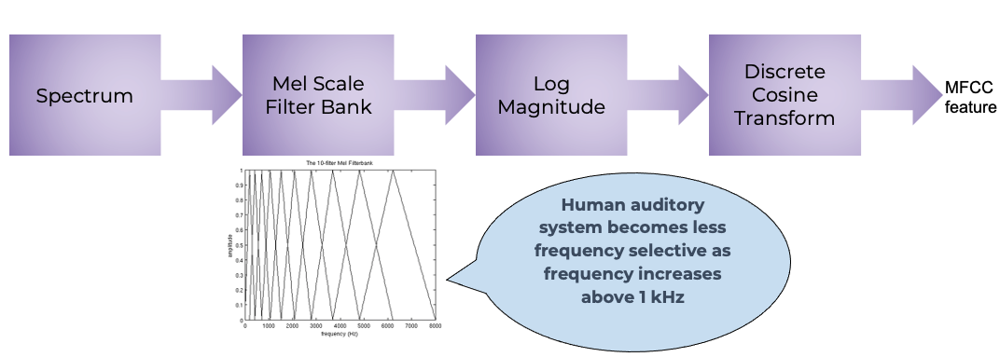
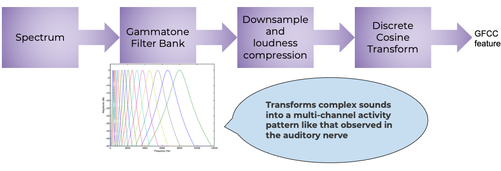

# Summary

PyAudioProcessing is a Python based library for processing audio data, forming and extracting numerical features from audio and further bulding machine learning models. This library allows you to extract features such as MFCC, GFCC, spectral features, chroma features and other beat based and cepstrum based features from audio to use with one's own classification backend or popular scikit-learn classifiers.

# Statement of need

PyAudioProcessing is a Python based library for processing audio data into features and building Machine Learning models. Audio processing and feature extraction research is popular in MATLAB. There are comparatively fewer resources for audio processing and classification in Python. This tool contains implementation of popular and different audio feature extraction that can be use in combination with most scikit-learn classifiers. Unique feature extractions such as Mel Frequency Cepstral Coefficients (MFCC), Gammatone Frequency Cepstral Coefficients (GFCC) [@inbook], spectral coefficients, chroma features and others are available to extract and use in combination with different backend classifiers. While MFCC features find use in most commonly encountered audio processing tasks such as audio type classification, speech classification, GFCC features have been found to have application in speaker identification/diarization. Many such applications, comparisons and uses can be found in this IEEE paper [@6639061].

# Audio features

Information about getting started with audio processing is described in @opensource. 

Passing a spectrum through the Mel filter bank, followed by taking the log magnitude and a discrete cosine transform (DCT) produces the Mel cepstrum. DCT extracts the signal's main information and peaks. It is also widely used in JPEG and MPEG compressions. The peaks are the gist of the audio information. Typically, the first 13 coefficients extracted from the Mel cepstrum are called the MFCCs. These hold very useful information about audio and are often used to train machine learning models. This can be further seen in the form of an illustration in \autoref{fig:mfcc}.

Another filter inspired by human hearing is the Gammatone filter bank. This filter bank is used as a front-end simulation of the cochlea. Thus, it has many applications in speech processing because it aims to replicate how we hear. GFCCs are formed by passing the spectrum through Gammatone filter bank, followed by loudness compression and DCT, as seen in \autoref{fig:gfcc}. The first (approximately) 22 features are called GFCCs. GFCCs have a number of applications in speech processing, such as speaker identification.

Other features useful in audio processing tasks (especially speech) include LPCC, BFCC, PNCC, and spectral features like spectral flux, entropy, roll off, centroid, spread, and energy entropy.

# References